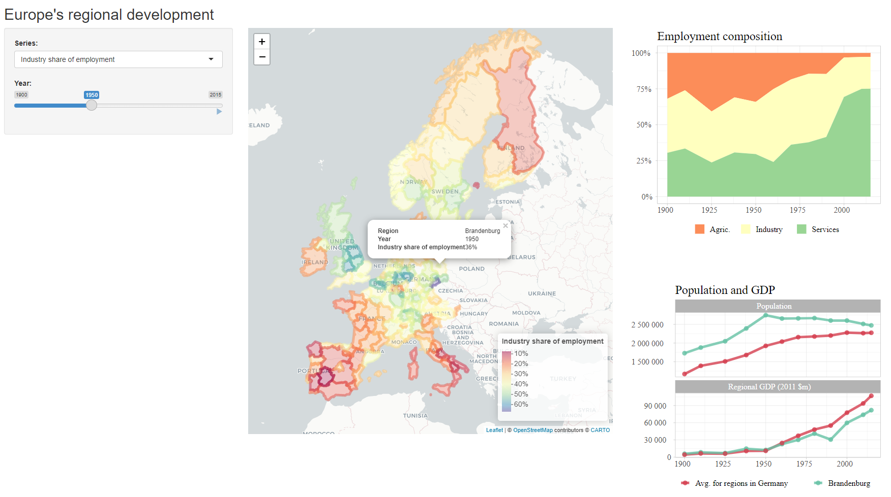

# Roses Wolf database on regional GDP

The Rosés-Wolf database on regional GDP provides data on the economic development of European regions at the level of NUTS-2 regions for the years 1900 - 2015. It contains information of nominal GDP (in 1990 and 2011 PPP), population, area, and on sector-level employment shares.

[Link to underlying data](https://www.wiwi.hu-berlin.de/de/professuren/vwl/wg/roses-wolf-database-on-regional-gdp)

It's super cool data! I wanted to make it clicky, and learn a bit more about {leaflet} maps. The best feature, I think, Is that if you click on a NUTS 2 region, you can get the evolution of employment shares over time in a stacked area chart as well as a line plot of population and GDP.

Here's what my app looks like: 

